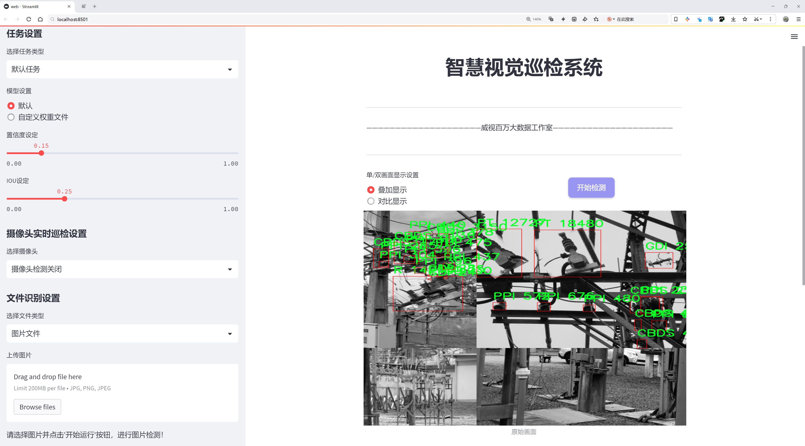

# 变电站设备检测检测系统源码分享
 # [一条龙教学YOLOV8标注好的数据集一键训练_70+全套改进创新点发刊_Web前端展示]

### 1.研究背景与意义

项目参考[AAAI Association for the Advancement of Artificial Intelligence](https://gitee.com/qunmasj/projects)

项目来源[AACV Association for the Advancement of Computer Vision](https://kdocs.cn/l/cszuIiCKVNis)

研究背景与意义

随着电力系统的不断发展，变电站作为电力传输和分配的重要环节，其设备的安全性和可靠性显得尤为重要。变电站内的设备种类繁多，包括断路器（CBDS）、电流互感器（CT）、电压互感器（PT）、避雷器（LA）等，数量多达14类，这些设备的正常运行直接关系到电力系统的稳定性和安全性。然而，传统的设备检测方法往往依赖人工巡检，效率低下且容易受到人为因素的影响，无法满足现代电力系统对高效、精准监测的需求。因此，基于计算机视觉的自动化检测系统应运而生，成为提升变电站设备管理效率的重要手段。

在这一背景下，YOLO（You Only Look Once）系列目标检测算法因其高效性和实时性被广泛应用于各类物体检测任务。YOLOv8作为该系列的最新版本，进一步提升了检测精度和速度，适合在复杂环境中进行变电站设备的实时监测。通过对YOLOv8算法的改进，可以更好地适应变电站内不同设备的特征，提升检测的准确性和鲁棒性。

本研究的意义在于，首先，通过构建基于改进YOLOv8的变电站设备检测系统，可以实现对变电站内各类设备的自动化识别与监测，极大地提高了设备管理的效率。根据提供的数据集，包含1653张图像和14个类别的设备信息，研究将利用这些数据进行模型训练和优化，确保检测系统能够在多样化的环境中稳定运行。其次，自动化检测系统的引入，将有效降低人工巡检的工作强度，减少人为错误，提高设备故障的早期识别能力，从而降低设备故障率，延长设备使用寿命。

此外，基于改进YOLOv8的检测系统不仅适用于变电站设备的监测，还可以为其他领域的设备检测提供借鉴。其高效的检测能力和实时反馈机制，可以推广至交通监控、安防监控等多个领域，具有广泛的应用前景。通过本研究的实施，将为电力行业的智能化发展提供重要支持，推动电力设备管理向数字化、智能化转型。

最后，随着人工智能技术的不断进步，基于深度学习的目标检测方法在实际应用中的价值愈加凸显。本研究不仅有助于提升变电站设备的管理水平，还将为相关领域的研究提供新的思路和方法，推动目标检测技术的进一步发展。通过对YOLOv8的改进和应用，研究将为电力行业的智能化、自动化发展提供重要的理论基础和实践指导，具有重要的学术价值和现实意义。

### 2.图片演示





##### 注意：由于此博客编辑较早，上面“2.图片演示”和“3.视频演示”展示的系统图片或者视频可能为老版本，新版本在老版本的基础上升级如下：（实际效果以升级的新版本为准）

  （1）适配了YOLOV8的“目标检测”模型和“实例分割”模型，通过加载相应的权重（.pt）文件即可自适应加载模型。

  （2）支持“图片识别”、“视频识别”、“摄像头实时识别”三种识别模式。

  （3）支持“图片识别”、“视频识别”、“摄像头实时识别”三种识别结果保存导出，解决手动导出（容易卡顿出现爆内存）存在的问题，识别完自动保存结果并导出到tempDir中。

  （4）支持Web前端系统中的标题、背景图等自定义修改，后面提供修改教程。

  另外本项目提供训练的数据集和训练教程,暂不提供权重文件（best.pt）,需要您按照教程进行训练后实现图片演示和Web前端界面演示的效果。

### 3.视频演示

[3.1 视频演示](https://www.bilibili.com/video/BV1MPsreUETL/)

### 4.数据集信息展示

##### 4.1 本项目数据集详细数据（类别数＆类别名）

nc: 14
names: ['B', 'CBDS', 'CT', 'CTDS', 'FSW', 'GDI', 'LA', 'M', 'OPDS', 'POW_T', 'PPI', 'PT', 'R', 'TDS']


##### 4.2 本项目数据集信息介绍

数据集信息展示

在现代电力系统中，变电站作为电力传输和分配的重要环节，其设备的实时监测与故障检测显得尤为重要。为此，我们构建了一个名为“Substation elements detection”的数据集，旨在为改进YOLOv8的变电站设备检测系统提供强有力的支持。该数据集包含14个类别，涵盖了变电站中常见的设备类型，这些设备在电力系统的运行和维护中扮演着关键角色。

在“Substation elements detection”数据集中，我们定义了14个类别，分别为：B、CBDS、CT、CTDS、FSW、GDI、LA、M、OPDS、POW_T、PPI、PT、R和TDS。这些类别不仅反映了变电站设备的多样性，也为模型的训练提供了丰富的样本来源。具体而言，B代表了基础设备，CBDS则是组合变电站设备，CT和CTDS分别表示电流互感器及其相关设备，FSW则指的是断路器，GDI为气体绝缘设备，LA是避雷器，M表示变压器，OPDS为操作开关设备，POW_T代表功率变压器，PPI为保护和控制设备，PT是电压互感器，R则指的是继电器，TDS则是变电站的温度监测设备。

该数据集的构建过程中，我们采用了高质量的图像采集技术，确保每个类别的样本都具有良好的可视性和清晰度。这些图像来自于不同类型的变电站，涵盖了多种工作环境和光照条件，以增强模型的泛化能力。此外，为了提高数据集的实用性，我们对图像进行了精确的标注，确保每个设备在图像中的位置和类别信息都准确无误。这种细致的标注工作不仅为模型的训练提供了可靠的数据基础，也为后续的模型评估和优化奠定了良好的基础。

在数据集的使用过程中，研究人员可以利用这些丰富的标注数据进行YOLOv8模型的训练与调优。通过对不同类别设备的特征进行学习，模型能够逐步提高对变电站设备的检测精度和识别速度。这一过程不仅有助于提升变电站的自动化监测水平，还能有效降低人工巡检的工作负担，提高设备的运行安全性和可靠性。

总之，“Substation elements detection”数据集为变电站设备检测系统的研究提供了重要的支持。通过对14个类别的全面覆盖，该数据集不仅为YOLOv8模型的训练提供了丰富的样本，也为未来的电力系统智能化发展打下了坚实的基础。随着技术的不断进步，我们期待这一数据集能够在更广泛的应用场景中发挥作用，推动变电站设备检测技术的不断创新与发展。


### 5.全套项目环境部署视频教程（零基础手把手教学）

[5.1 环境部署教程链接（零基础手把手教学）](https://www.ixigua.com/7404473917358506534?logTag=c807d0cbc21c0ef59de5)


[5.2 安装Python虚拟环境创建和依赖库安装视频教程链接（零基础手把手教学）](https://www.ixigua.com/7404474678003106304?logTag=1f1041108cd1f708b01a)

### 6.手把手YOLOV8训练视频教程（零基础小白有手就能学会）

[6.1 手把手YOLOV8训练视频教程（零基础小白有手就能学会）](https://www.ixigua.com/7404477157818401292?logTag=d31a2dfd1983c9668658)

### 7.70+种全套YOLOV8创新点代码加载调参视频教程（一键加载写好的改进模型的配置文件）

[7.1 70+种全套YOLOV8创新点代码加载调参视频教程（一键加载写好的改进模型的配置文件）](https://www.ixigua.com/7404478314661806627?logTag=29066f8288e3f4eea3a4)

### 8.70+种全套YOLOV8创新点原理讲解（非科班也可以轻松写刊发刊，V10版本正在科研待更新）

由于篇幅限制，每个创新点的具体原理讲解就不一一展开，具体见下列网址中的创新点对应子项目的技术原理博客网址【Blog】：


[8.1 70+种全套YOLOV8创新点原理讲解链接](https://gitee.com/qunmasj/good)

### 9.系统功能展示（检测对象为举例，实际内容以本项目数据集为准）

图9.1.系统支持检测结果表格显示

  图9.2.系统支持置信度和IOU阈值手动调节

  图9.3.系统支持自定义加载权重文件best.pt(需要你通过步骤5中训练获得)

  图9.4.系统支持摄像头实时识别

  图9.5.系统支持图片识别

  图9.6.系统支持视频识别

  图9.7.系统支持识别结果文件自动保存

  图9.8.系统支持Excel导出检测结果数据


### 10.原始YOLOV8算法原理

原始YOLOv8算法原理

YOLOv8作为YOLO系列中的最新版本，继承并优化了前几代模型的设计理念，采用了anchor-free的检测方法，显著提升了目标检测的精度和速度。其网络结构主要由输入端、主干网络、Neck端和输出端四个部分组成，构成了一个高效的目标检测系统。YOLOv8的设计旨在解决传统anchor-based方法在小目标检测和复杂背景下的局限性，尤其是在水面环境等复杂场景中，表现出色。

在输入端，YOLOv8首先对输入图像进行预处理，采用Mosaic数据增强、自适应图片缩放和灰度填充等技术，以提高模型的鲁棒性和泛化能力。Mosaic增强通过将多张图像拼接在一起，生成新的训练样本，增加了数据的多样性，有助于模型学习到更丰富的特征。此外，自适应图片缩放确保了不同尺寸的目标都能被有效检测，灰度填充则帮助模型更好地处理边缘信息。

主干网络是YOLOv8的核心部分，负责提取输入图像的特征。与以往版本不同，YOLOv8采用了C2f模块替代了C3模块，增强了特征提取的能力。C2f模块通过引入更多的卷积层和池化层，能够更好地捕捉图像中的细节信息，并保留了梯度流动，确保特征在网络中的有效传递。同时，SPPF模块通过不同内核尺寸的池化操作，对特征图进行处理，进一步增强了特征的表达能力。这种设计使得YOLOv8在处理不同尺度的目标时，能够保持较高的检测精度。

在Neck端，YOLOv8采用了双塔结构，结合了特征金字塔网络（FPN）和路径聚合网络（PAN），有效地融合了来自不同层次的特征信息。通过上采样和下采样的操作，Neck端能够整合不同尺度的特征图，增强了模型对多尺度目标的检测能力。这种特征融合的方式，使得YOLOv8在面对复杂背景和小目标时，能够更好地进行定位和分类。

输出端采用了decoupled head结构，将分类和回归过程解耦，分别处理正负样本的匹配和损失计算。这种解耦设计不仅提高了模型的训练效率，还降低了计算复杂度。YOLOv8引入了Task-Aligned Assigner方法，对分类分数和回归分数进行加权，以优化正样本的匹配过程。损失计算方面，YOLOv8使用了BCE（binary cross-entropy）计算分类损失，并结合DFL（distribution focal loss）和CIoU（complete intersection over union）损失函数计算回归损失，从而提升了模型的检测精度和泛化能力。

尽管YOLOv8在许多方面表现优异，但在复杂水面环境下，仍然面临着小目标漂浮物特征复杂、背景多样的问题。这导致了模型在定位精度和目标感知能力上的不足。因此，针对这些缺陷，YOLOv8-WSSOD算法应运而生，旨在进一步提升YOLOv8的性能。

YOLOv8-WSSOD算法通过引入BiFormer双层路由注意力机制构建C2fBF模块，旨在减轻主干网络下采样过程中的噪声影响，保留更细粒度的上下文信息。这一改进使得模型在处理复杂背景时，能够更好地理解目标与背景之间的关系，从而提高了小目标的检测能力。此外，为了应对小目标漏检的问题，YOLOv8-WSSOD在网络中添加了一个更小的检测头，以增强对小目标的感知力。结合GSConv和Slim-neck技术，进一步保持了模型的精度，同时降低了计算量。

最后，YOLOv8-WSSOD还使用了MPDIoU损失函数替换了CIoU损失函数，进一步提升了模型的泛化能力和精准度。这一系列的改进，使得YOLOv8在复杂水面环境下的表现更加出色，能够有效应对小目标的检测挑战。

综上所述，YOLOv8通过其创新的网络结构和高效的特征处理方法，展现了强大的目标检测能力。尽管在某些复杂环境下仍存在不足，但通过针对性的改进，YOLOv8及其衍生版本如YOLOv8-WSSOD，正在不断提升目标检测的精度和效率，为实际应用提供了更为可靠的解决方案。


### 11.项目核心源码讲解（再也不用担心看不懂代码逻辑）

#### 11.1 code\ultralytics\models\fastsam\predict.py

以下是对代码的核心部分进行提炼和详细注释的结果：

```python
# 导入必要的库
import torch
from ultralytics.engine.results import Results
from ultralytics.models.fastsam.utils import bbox_iou
from ultralytics.models.yolo.detect.predict import DetectionPredictor
from ultralytics.utils import ops

class FastSAMPredictor(DetectionPredictor):
    """
    FastSAMPredictor 类专门用于在 Ultralytics YOLO 框架中进行快速 SAM（Segment Anything Model）分割预测任务。
    该类继承自 DetectionPredictor，定制了预测管道，特别适用于快速 SAM。
    """

    def __init__(self, cfg=DEFAULT_CFG, overrides=None, _callbacks=None):
        """
        初始化 FastSAMPredictor 类，设置任务为 'segment'（分割）。

        Args:
            cfg (dict): 预测的配置参数。
            overrides (dict, optional): 可选的参数覆盖，用于自定义行为。
            _callbacks (dict, optional): 可选的回调函数列表，在预测过程中调用。
        """
        super().__init__(cfg, overrides, _callbacks)  # 调用父类构造函数
        self.args.task = "segment"  # 设置任务为分割

    def postprocess(self, preds, img, orig_imgs):
        """
        对模型的预测结果进行后处理，包括非极大值抑制和将框缩放到原始图像大小，并返回最终结果。

        Args:
            preds (list): 模型的原始输出预测。
            img (torch.Tensor): 处理后的图像张量。
            orig_imgs (list | torch.Tensor): 原始图像或图像列表。

        Returns:
            (list): 包含处理后的框、掩码和其他元数据的 Results 对象列表。
        """
        # 执行非极大值抑制，过滤掉低置信度的预测框
        p = ops.non_max_suppression(
            preds[0],
            self.args.conf,
            self.args.iou,
            agnostic=self.args.agnostic_nms,
            max_det=self.args.max_det,
            nc=1,  # SAM 没有类别预测，因此设置为 1 类
            classes=self.args.classes,
        )

        # 创建一个全框，用于后续处理
        full_box = torch.zeros(p[0].shape[1], device=p[0].device)
        full_box[2], full_box[3], full_box[4], full_box[6:] = img.shape[3], img.shape[2], 1.0, 1.0
        full_box = full_box.view(1, -1)

        # 计算与全框的 IoU，并更新 full_box
        critical_iou_index = bbox_iou(full_box[0][:4], p[0][:, :4], iou_thres=0.9, image_shape=img.shape[2:])
        if critical_iou_index.numel() != 0:
            full_box[0][4] = p[0][critical_iou_index][:, 4]
            full_box[0][6:] = p[0][critical_iou_index][:, 6:]
            p[0][critical_iou_index] = full_box  # 更新预测框

        # 如果输入图像是张量而不是列表，则转换为 numpy 格式
        if not isinstance(orig_imgs, list):
            orig_imgs = ops.convert_torch2numpy_batch(orig_imgs)

        results = []  # 存储最终结果
        proto = preds[1][-1] if len(preds[1]) == 3 else preds[1]  # 获取掩码原型

        # 遍历每个预测结果
        for i, pred in enumerate(p):
            orig_img = orig_imgs[i]  # 获取原始图像
            img_path = self.batch[0][i]  # 获取图像路径

            if not len(pred):  # 如果没有预测框
                masks = None
            elif self.args.retina_masks:  # 处理带有 retina 掩码的情况
                pred[:, :4] = ops.scale_boxes(img.shape[2:], pred[:, :4], orig_img.shape)  # 缩放框
                masks = ops.process_mask_native(proto[i], pred[:, 6:], pred[:, :4], orig_img.shape[:2])  # 处理掩码
            else:  # 处理普通掩码
                masks = ops.process_mask(proto[i], pred[:, 6:], pred[:, :4], img.shape[2:], upsample=True)  # 处理掩码
                pred[:, :4] = ops.scale_boxes(img.shape[2:], pred[:, :4], orig_img.shape)  # 缩放框

            # 将结果存储到列表中
            results.append(Results(orig_img, path=img_path, names=self.model.names, boxes=pred[:, :6], masks=masks))

        return results  # 返回处理后的结果列表
```

### 代码核心部分说明：
1. **类定义**：`FastSAMPredictor` 继承自 `DetectionPredictor`，专门用于快速 SAM 分割预测。
2. **初始化方法**：设置任务为分割，并调用父类的初始化方法。
3. **后处理方法**：对模型的预测结果进行后处理，包括非极大值抑制、框的缩放和掩码的处理，最终返回处理后的结果。

该文件是一个用于快速分割预测的类`FastSAMPredictor`，它继承自`DetectionPredictor`，并专门针对Ultralytics YOLO框架中的快速SAM（Segment Anything Model）分割任务进行了定制。该类的主要功能是处理图像分割的预测过程，尤其是在单类分割的情况下进行优化。

在初始化方法`__init__`中，`FastSAMPredictor`类接收配置参数`cfg`、可选的参数覆盖`overrides`以及可选的回调函数`_callbacks`。通过调用父类的初始化方法，设置任务类型为“segment”，表明该类的主要任务是图像分割。

`postprocess`方法是该类的核心功能之一，它负责对模型的原始输出进行后处理。该方法接收三个参数：`preds`是模型的原始预测输出，`img`是处理后的图像张量，`orig_imgs`是原始图像或图像列表。后处理步骤包括非极大值抑制（NMS）和将预测框缩放到原始图像大小。

在后处理过程中，首先使用`ops.non_max_suppression`函数对预测结果进行非极大值抑制，以去除冗余的框。接着，创建一个全框`full_box`，其形状与预测框相同，并设置一些初始值。然后，通过计算IOU（Intersection over Union）来确定哪些预测框与全框的重叠度足够高，并根据这些信息更新全框的内容。

接下来，检查输入的原始图像是否为列表，如果不是，则将其转换为NumPy格式。然后，遍历每个预测结果，根据预测的内容处理掩膜（masks）。如果没有预测框，则掩膜为`None`；如果需要返回细节掩膜，则根据不同的条件处理掩膜。最后，将处理后的结果封装为`Results`对象，并返回一个包含所有结果的列表。

总体而言，该文件的代码实现了一个高效的分割预测流程，能够处理图像分割任务中的各种细节，并为后续的应用提供了良好的基础。

#### 11.2 70+种YOLOv8算法改进源码大全和调试加载训练教程（非必要）\ultralytics\nn\extra_modules\dynamic_snake_conv.py

以下是经过简化和注释的核心代码部分，主要保留了 `DySnakeConv` 和 `DSConv` 类的定义及其关键功能。

```python
import torch
import torch.nn as nn

class DySnakeConv(nn.Module):
    def __init__(self, inc, ouc, k=3) -> None:
        """
        初始化 DySnakeConv 模块
        :param inc: 输入通道数
        :param ouc: 输出通道数
        :param k: 卷积核大小，默认为 3
        """
        super().__init__()
        
        # 定义三个卷积层
        self.conv_0 = Conv(inc, ouc, k)  # 标准卷积
        self.conv_x = DSConv(inc, ouc, 0, k)  # 沿 x 轴的动态蛇卷积
        self.conv_y = DSConv(inc, ouc, 1, k)  # 沿 y 轴的动态蛇卷积
    
    def forward(self, x):
        """
        前向传播
        :param x: 输入特征图
        :return: 拼接后的输出特征图
        """
        # 将三个卷积的输出在通道维度上拼接
        return torch.cat([self.conv_0(x), self.conv_x(x), self.conv_y(x)], dim=1)

class DSConv(nn.Module):
    def __init__(self, in_ch, out_ch, morph, kernel_size=3, if_offset=True, extend_scope=1):
        """
        动态蛇卷积的初始化
        :param in_ch: 输入通道数
        :param out_ch: 输出通道数
        :param morph: 卷积核的形态（0: x 轴，1: y 轴）
        :param kernel_size: 卷积核大小
        :param if_offset: 是否需要偏移
        :param extend_scope: 扩展范围
        """
        super(DSConv, self).__init__()
        # 学习可变形偏移的卷积层
        self.offset_conv = nn.Conv2d(in_ch, 2 * kernel_size, 3, padding=1)
        self.bn = nn.BatchNorm2d(2 * kernel_size)  # 批归一化
        self.kernel_size = kernel_size

        # 定义沿 x 轴和 y 轴的动态蛇卷积
        self.dsc_conv_x = nn.Conv2d(in_ch, out_ch, kernel_size=(kernel_size, 1), stride=(kernel_size, 1), padding=0)
        self.dsc_conv_y = nn.Conv2d(in_ch, out_ch, kernel_size=(1, kernel_size), stride=(1, kernel_size), padding=0)

        self.gn = nn.GroupNorm(out_ch // 4, out_ch)  # 组归一化
        self.act = Conv.default_act  # 默认激活函数

        self.extend_scope = extend_scope
        self.morph = morph
        self.if_offset = if_offset

    def forward(self, f):
        """
        前向传播
        :param f: 输入特征图
        :return: 经过动态蛇卷积后的特征图
        """
        # 计算偏移
        offset = self.offset_conv(f)
        offset = self.bn(offset)
        offset = torch.tanh(offset)  # 将偏移限制在 -1 到 1 之间

        # 根据形态选择不同的卷积路径
        if self.morph == 0:
            x = self.dsc_conv_x(f)  # 沿 x 轴卷积
        else:
            x = self.dsc_conv_y(f)  # 沿 y 轴卷积
        
        x = self.gn(x)  # 归一化
        x = self.act(x)  # 激活
        return x
```

### 代码说明
1. **DySnakeConv 类**:
   - 该类实现了一个包含标准卷积和两个动态蛇卷积的复合卷积层。
   - 在 `forward` 方法中，将三个卷积的输出在通道维度上拼接。

2. **DSConv 类**:
   - 该类实现了动态蛇卷积的具体逻辑，支持可变形卷积。
   - 在 `forward` 方法中，首先计算偏移，然后根据形态选择相应的卷积路径，并进行归一化和激活。

3. **偏移学习**:
   - 使用一个卷积层来学习偏移量，这些偏移量用于动态调整卷积核的位置，以适应输入特征图的形状。

通过这些注释，可以更好地理解代码的结构和功能。

这个程序文件实现了动态蛇形卷积（Dynamic Snake Convolution）的一种变体，主要用于深度学习中的卷积神经网络（CNN）。该文件定义了两个主要的类：`DySnakeConv` 和 `DSConv`，以及一个辅助类 `DSC`，用于处理动态卷积的计算。

在 `DySnakeConv` 类中，构造函数初始化了三个卷积层：`conv_0`、`conv_x` 和 `conv_y`。其中，`conv_0` 是标准卷积，`conv_x` 和 `conv_y` 是基于蛇形卷积的变体，分别沿着 x 轴和 y 轴进行卷积操作。在前向传播方法 `forward` 中，这三个卷积的输出被连接在一起，形成最终的输出。

`DSConv` 类实现了动态蛇形卷积的核心逻辑。构造函数接收输入通道数、输出通道数、卷积核大小、形态参数等，并初始化了偏移卷积层和两个不同方向的卷积层。前向传播方法中，首先通过偏移卷积层计算出偏移量，然后利用这些偏移量进行卷积操作。偏移量经过批量归一化处理，并通过 `tanh` 函数进行限制，以模拟蛇的摆动。

`DSC` 类负责计算坐标映射和双线性插值。它的 `_coordinate_map_3D` 方法根据输入特征图的形状和偏移量生成新的坐标映射，而 `_bilinear_interpolate_3D` 方法则根据这些坐标对输入特征图进行双线性插值，从而实现动态卷积的效果。

整个实现通过将标准卷积与动态偏移结合，增强了卷积层的灵活性和表达能力，使得模型能够更好地适应复杂的输入数据。这个动态蛇形卷积的设计可以用于提高计算机视觉任务中的性能，尤其是在目标检测和图像分割等领域。

#### 11.3 ui.py

以下是代码中最核心的部分，并附上详细的中文注释：

```python
import sys
import subprocess

def run_script(script_path):
    """
    使用当前 Python 环境运行指定的脚本。

    Args:
        script_path (str): 要运行的脚本路径

    Returns:
        None
    """
    # 获取当前 Python 解释器的路径
    python_path = sys.executable

    # 构建运行命令，使用 streamlit 运行指定的脚本
    command = f'"{python_path}" -m streamlit run "{script_path}"'

    # 执行命令
    result = subprocess.run(command, shell=True)
    # 检查命令执行结果，如果返回码不为0，表示执行出错
    if result.returncode != 0:
        print("脚本运行出错。")

# 实例化并运行应用
if __name__ == "__main__":
    # 指定要运行的脚本路径
    script_path = "web.py"  # 这里可以直接指定脚本名，假设它在当前目录下

    # 调用函数运行脚本
    run_script(script_path)
```

### 代码说明：
1. **导入模块**：
   - `sys`：用于访问与 Python 解释器紧密相关的变量和函数。
   - `subprocess`：用于创建新进程、连接到它们的输入/输出/错误管道，并获取它们的返回码。

2. **`run_script` 函数**：
   - 该函数接受一个参数 `script_path`，表示要运行的 Python 脚本的路径。
   - 使用 `sys.executable` 获取当前 Python 解释器的路径，以确保使用正确的 Python 环境。
   - 构建一个命令字符串，使用 `streamlit` 模块运行指定的脚本。
   - 使用 `subprocess.run` 执行命令，并通过 `shell=True` 允许在 shell 中执行命令。
   - 检查命令的返回码，如果不为0，表示脚本运行出错，并打印错误信息。

3. **主程序部分**：
   - 使用 `if __name__ == "__main__":` 确保只有在直接运行该脚本时才会执行以下代码。
   - 指定要运行的脚本路径（在这里是 `web.py`）。
   - 调用 `run_script` 函数来执行指定的脚本。

这个程序文件的主要功能是通过当前的 Python 环境来运行一个指定的脚本，具体来说是运行一个名为 `web.py` 的脚本。程序首先导入了必要的模块，包括 `sys`、`os` 和 `subprocess`，这些模块分别用于获取系统信息、处理文件路径和执行系统命令。

在程序中定义了一个名为 `run_script` 的函数，该函数接受一个参数 `script_path`，表示要运行的脚本的路径。函数内部首先获取当前 Python 解释器的路径，这样可以确保使用的是正确的 Python 环境。接着，构建一个命令字符串，该命令使用 `streamlit` 模块来运行指定的脚本。`streamlit` 是一个用于构建数据应用的库，命令的格式是 `"python_path" -m streamlit run "script_path"`。

然后，使用 `subprocess.run` 方法来执行这个命令。这个方法会在一个新的 shell 中运行命令，并返回一个结果对象。通过检查 `result.returncode`，可以判断脚本是否成功运行。如果返回码不为 0，说明脚本运行出错，程序会打印出相应的错误信息。

在文件的最后部分，使用 `if __name__ == "__main__":` 来确保只有在直接运行该文件时才会执行下面的代码。这里指定了要运行的脚本路径为 `web.py`，并调用 `run_script` 函数来执行这个脚本。

总体来说，这个程序的目的是为了方便地通过当前的 Python 环境来运行一个 Streamlit 应用脚本，确保了路径的正确性和执行的有效性。

#### 11.4 train.py

以下是代码中最核心的部分，并附上详细的中文注释：

```python
class DetectionTrainer(BaseTrainer):
    """
    DetectionTrainer类扩展了BaseTrainer类，用于基于检测模型的训练。
    """

    def build_dataset(self, img_path, mode="train", batch=None):
        """
        构建YOLO数据集。

        参数:
            img_path (str): 包含图像的文件夹路径。
            mode (str): 模式，可以是'train'或'val'，用户可以为每种模式自定义不同的增强。
            batch (int, optional): 批次大小，仅用于'rect'模式。默认为None。
        """
        gs = max(int(de_parallel(self.model).stride.max() if self.model else 0), 32)
        return build_yolo_dataset(self.args, img_path, batch, self.data, mode=mode, rect=mode == "val", stride=gs)

    def get_dataloader(self, dataset_path, batch_size=16, rank=0, mode="train"):
        """构造并返回数据加载器。"""
        assert mode in ["train", "val"]  # 确保模式有效
        with torch_distributed_zero_first(rank):  # 在分布式训练中，确保数据集只初始化一次
            dataset = self.build_dataset(dataset_path, mode, batch_size)  # 构建数据集
        shuffle = mode == "train"  # 训练模式下打乱数据
        if getattr(dataset, "rect", False) and shuffle:
            LOGGER.warning("WARNING ⚠️ 'rect=True'与DataLoader的shuffle不兼容，设置shuffle=False")
            shuffle = False
        workers = self.args.workers if mode == "train" else self.args.workers * 2  # 设置工作线程数
        return build_dataloader(dataset, batch_size, workers, shuffle, rank)  # 返回数据加载器

    def preprocess_batch(self, batch):
        """对一批图像进行预处理，包括缩放和转换为浮点数。"""
        batch["img"] = batch["img"].to(self.device, non_blocking=True).float() / 255  # 将图像转换为浮点数并归一化
        if self.args.multi_scale:  # 如果启用多尺度
            imgs = batch["img"]
            sz = (
                random.randrange(self.args.imgsz * 0.5, self.args.imgsz * 1.5 + self.stride)
                // self.stride
                * self.stride
            )  # 随机选择一个新的尺寸
            sf = sz / max(imgs.shape[2:])  # 计算缩放因子
            if sf != 1:  # 如果需要缩放
                ns = [
                    math.ceil(x * sf / self.stride) * self.stride for x in imgs.shape[2:]
                ]  # 计算新的形状
                imgs = nn.functional.interpolate(imgs, size=ns, mode="bilinear", align_corners=False)  # 进行插值缩放
            batch["img"] = imgs  # 更新批次图像
        return batch

    def get_model(self, cfg=None, weights=None, verbose=True):
        """返回一个YOLO检测模型。"""
        model = DetectionModel(cfg, nc=self.data["nc"], verbose=verbose and RANK == -1)  # 创建检测模型
        if weights:
            model.load(weights)  # 加载权重
        return model

    def get_validator(self):
        """返回用于YOLO模型验证的DetectionValidator。"""
        self.loss_names = "box_loss", "cls_loss", "dfl_loss"  # 定义损失名称
        return yolo.detect.DetectionValidator(
            self.test_loader, save_dir=self.save_dir, args=copy(self.args), _callbacks=self.callbacks
        )  # 返回验证器

    def plot_training_samples(self, batch, ni):
        """绘制带有注释的训练样本。"""
        plot_images(
            images=batch["img"],
            batch_idx=batch["batch_idx"],
            cls=batch["cls"].squeeze(-1),
            bboxes=batch["bboxes"],
            paths=batch["im_file"],
            fname=self.save_dir / f"train_batch{ni}.jpg",
            on_plot=self.on_plot,
        )  # 绘制图像并保存

    def plot_metrics(self):
        """从CSV文件中绘制指标。"""
        plot_results(file=self.csv, on_plot=self.on_plot)  # 保存结果图像
```

### 代码核心部分说明：
1. **DetectionTrainer类**：该类用于处理YOLO模型的训练，继承自BaseTrainer类。
2. **build_dataset方法**：构建YOLO数据集，支持训练和验证模式。
3. **get_dataloader方法**：创建数据加载器，支持分布式训练。
4. **preprocess_batch方法**：对输入图像进行预处理，包括归一化和多尺度处理。
5. **get_model方法**：返回YOLO检测模型，可以加载预训练权重。
6. **get_validator方法**：返回用于模型验证的验证器。
7. **plot_training_samples和plot_metrics方法**：用于可视化训练样本和训练指标。

这个程序文件 `train.py` 是一个用于训练 YOLO（You Only Look Once）目标检测模型的脚本，继承自 `BaseTrainer` 类。它包含了一系列方法，用于构建数据集、获取数据加载器、预处理图像批次、设置模型属性、获取模型、进行验证、记录损失、输出训练进度、绘制训练样本和绘制训练指标等。

首先，`DetectionTrainer` 类定义了一个用于目标检测的训练器。用户可以通过传入模型路径、数据集配置文件和训练轮数等参数来实例化该类，并调用 `train()` 方法开始训练。

在 `build_dataset` 方法中，程序会根据给定的图像路径和模式（训练或验证）构建 YOLO 数据集。这个方法会使用 `build_yolo_dataset` 函数，支持用户为不同模式自定义数据增强。

`get_dataloader` 方法用于构建并返回数据加载器。它会根据模式选择是否打乱数据，并设置工作线程的数量。对于分布式训练，程序会确保数据集只初始化一次。

`preprocess_batch` 方法负责对图像批次进行预处理，包括将图像缩放到合适的大小并转换为浮点数。该方法还支持多尺度训练，随机选择图像大小以增强模型的鲁棒性。

`set_model_attributes` 方法将数据集的类数和类名等信息附加到模型上，以便模型能够正确识别和处理数据。

`get_model` 方法返回一个 YOLO 检测模型实例，并可以加载预训练权重。

`get_validator` 方法返回一个用于验证模型性能的验证器，记录损失值。

`label_loss_items` 方法用于返回带有标签的训练损失字典，方便监控训练过程中的损失变化。

`progress_string` 方法生成一个格式化的字符串，显示训练进度，包括当前轮次、GPU 内存使用情况、损失值、实例数量和图像大小等信息。

`plot_training_samples` 方法用于绘制训练样本及其标注，便于可视化训练数据的质量。

最后，`plot_metrics` 和 `plot_training_labels` 方法分别用于绘制训练过程中的指标和标签，帮助用户更好地理解模型的训练效果和数据分布。

总体来说，这个文件实现了 YOLO 模型训练的核心功能，涵盖了数据处理、模型构建、训练监控和结果可视化等多个方面。

#### 11.5 70+种YOLOv8算法改进源码大全和调试加载训练教程（非必要）\ultralytics\engine\predictor.py

以下是代码中最核心的部分，并附上详细的中文注释：

```python
class BasePredictor:
    """
    BasePredictor类。

    这是一个用于创建预测器的基类。

    属性:
        args (SimpleNamespace): 预测器的配置。
        save_dir (Path): 保存结果的目录。
        model (nn.Module): 用于预测的模型。
        device (torch.device): 用于预测的设备。
        dataset (Dataset): 用于预测的数据集。
    """

    def __init__(self, cfg=DEFAULT_CFG, overrides=None, _callbacks=None):
        """
        初始化BasePredictor类。

        参数:
            cfg (str, optional): 配置文件的路径。默认为DEFAULT_CFG。
            overrides (dict, optional): 配置覆盖。默认为None。
        """
        self.args = get_cfg(cfg, overrides)  # 获取配置
        self.save_dir = get_save_dir(self.args)  # 获取保存目录
        self.done_warmup = False  # 是否完成预热
        self.model = None  # 初始化模型为None
        self.device = None  # 初始化设备为None
        self.dataset = None  # 初始化数据集为None
        self.callbacks = _callbacks or callbacks.get_default_callbacks()  # 获取回调函数

    def preprocess(self, im):
        """
        在推理之前准备输入图像。

        参数:
            im (torch.Tensor | List(np.ndarray)): 输入图像，支持张量或列表格式。
        """
        not_tensor = not isinstance(im, torch.Tensor)  # 检查输入是否为张量
        if not_tensor:
            im = np.stack(self.pre_transform(im))  # 预处理图像
            im = im[..., ::-1].transpose((0, 3, 1, 2))  # BGR转RGB，并调整维度
            im = np.ascontiguousarray(im)  # 确保数组是连续的
            im = torch.from_numpy(im)  # 转换为张量

        im = im.to(self.device)  # 将图像移动到指定设备
        im = im.half() if self.model.fp16 else im.float()  # 转换数据类型
        if not_tensor:
            im /= 255  # 将像素值从0-255缩放到0.0-1.0
        return im

    def inference(self, im, *args, **kwargs):
        """对给定图像运行推理。"""
        return self.model(im, augment=self.args.augment)  # 使用模型进行推理

    def __call__(self, source=None, model=None, stream=False, *args, **kwargs):
        """对图像或流执行推理。"""
        self.stream = stream  # 设置流模式
        if stream:
            return self.stream_inference(source, model, *args, **kwargs)  # 实时推理
        else:
            return list(self.stream_inference(source, model, *args, **kwargs))  # 返回推理结果列表

    def stream_inference(self, source=None, model=None, *args, **kwargs):
        """在摄像头输入上进行实时推理并将结果保存到文件。"""
        if not self.model:
            self.setup_model(model)  # 设置模型

        self.setup_source(source if source is not None else self.args.source)  # 设置数据源

        # 预热模型
        if not self.done_warmup:
            self.model.warmup(imgsz=(1, 3, *self.imgsz))  # 预热模型
            self.done_warmup = True

        for batch in self.dataset:  # 遍历数据集
            path, im0s, vid_cap, s = batch  # 获取当前批次的路径、图像和视频捕获对象

            im = self.preprocess(im0s)  # 预处理图像
            preds = self.inference(im, *args, **kwargs)  # 进行推理
            self.results = self.postprocess(preds, im, im0s)  # 后处理推理结果

            # 可视化、保存和写入结果
            for i in range(len(im0s)):
                p, im0 = path[i], im0s[i].copy()  # 获取路径和图像
                self.write_results(i, self.results, (p, im, im0))  # 写入结果

            yield from self.results  # 生成推理结果

    def setup_model(self, model, verbose=True):
        """使用给定参数初始化YOLO模型并设置为评估模式。"""
        self.model = AutoBackend(model or self.args.model, device=select_device(self.args.device, verbose=verbose))
        self.device = self.model.device  # 更新设备
        self.model.eval()  # 设置模型为评估模式
```

### 代码核心部分解释
1. **BasePredictor类**: 这是一个用于图像推理的基类，封装了模型加载、图像预处理、推理、后处理等功能。
2. **初始化方法**: 在初始化时加载配置、设置保存目录、初始化模型和设备等。
3. **预处理方法**: 负责将输入图像转换为模型所需的格式，包括类型转换和归一化。
4. **推理方法**: 调用模型进行推理，返回预测结果。
5. **流推理方法**: 处理实时视频流的推理，支持从摄像头或视频文件读取数据。
6. **模型设置方法**: 初始化YOLO模型并设置为评估模式。

这个程序文件是Ultralytics YOLO（You Only Look Once）模型的预测器实现，主要用于在各种数据源（如图像、视频、网络摄像头等）上进行目标检测。文件中包含了多个类和方法，主要功能是设置模型、处理输入数据、执行推理、处理输出结果，并支持实时流媒体处理。

首先，文件开头的文档字符串说明了如何使用YOLO模型进行预测，包括支持的输入源类型（如图像文件、视频文件、网络摄像头、YouTube链接等）和模型格式（如PyTorch、ONNX、TensorRT等）。这为用户提供了清晰的使用指南。

`BasePredictor`类是该文件的核心类，负责初始化预测器的配置、模型和数据源。构造函数中会调用`get_cfg`函数获取配置，并设置一些默认参数，如置信度阈值。类中定义了多个属性，如模型、数据集、设备等，方便后续的推理操作。

`preprocess`方法用于在推理前对输入图像进行预处理，包括将图像转换为张量格式，并进行归一化处理。`inference`方法则执行模型推理，返回预测结果。`postprocess`方法用于对模型的输出进行后处理，通常包括将模型输出转换为可读格式。

在`__call__`方法中，用户可以通过传入数据源和模型进行推理。如果设置为流式处理，则调用`stream_inference`方法，支持实时视频流的推理。

`setup_source`方法用于配置输入源和推理模式，确保输入图像的尺寸符合模型要求。`stream_inference`方法是实时推理的实现，循环处理输入数据，进行预处理、推理和后处理，并根据需要保存结果或显示图像。

`write_results`方法负责将推理结果写入文件或目录，支持保存边界框、置信度等信息。`show`方法使用OpenCV显示图像，方便用户实时查看推理结果。

最后，文件还支持回调机制，允许用户在特定事件（如开始推理、处理每个批次等）时执行自定义函数，增强了程序的灵活性和可扩展性。

整体来看，这个文件实现了YOLO模型的预测功能，提供了丰富的配置选项和灵活的输入输出处理方式，适合用于各种目标检测任务。

#### 11.6 70+种YOLOv8算法改进源码大全和调试加载训练教程（非必要）\ultralytics\nn\extra_modules\ops_dcnv3\modules\dcnv3.py

以下是代码中最核心的部分，并附上详细的中文注释：

```python
import torch
from torch import nn
import torch.nn.functional as F

class DCNv3(nn.Module):
    def __init__(self,
                 channels=64,
                 kernel_size=3,
                 stride=1,
                 pad=1,
                 dilation=1,
                 group=4,
                 offset_scale=1.0,
                 center_feature_scale=False,
                 remove_center=False):
        """
        DCNv3模块的初始化函数
        :param channels: 输入通道数
        :param kernel_size: 卷积核大小
        :param stride: 步幅
        :param pad: 填充
        :param dilation: 膨胀率
        :param group: 分组数
        :param offset_scale: 偏移缩放因子
        :param center_feature_scale: 是否使用中心特征缩放
        :param remove_center: 是否移除中心
        """
        super().__init__()
        # 检查通道数是否可以被分组数整除
        if channels % group != 0:
            raise ValueError(f'channels must be divisible by group, but got {channels} and {group}')
        
        self.channels = channels
        self.kernel_size = kernel_size
        self.stride = stride
        self.dilation = dilation
        self.pad = pad
        self.group = group
        self.group_channels = channels // group
        self.offset_scale = offset_scale
        self.center_feature_scale = center_feature_scale
        self.remove_center = int(remove_center)

        # 初始化卷积层和线性层
        self.dw_conv = nn.Conv2d(channels, channels, kernel_size, stride=1, padding=pad, groups=channels)
        self.offset = nn.Linear(channels, group * (kernel_size * kernel_size - remove_center) * 2)
        self.mask = nn.Linear(channels, group * (kernel_size * kernel_size - remove_center))
        self.input_proj = nn.Linear(channels, channels)
        self.output_proj = nn.Linear(channels, channels)
        self._reset_parameters()  # 重置参数

        # 如果启用中心特征缩放，初始化相关参数
        if center_feature_scale:
            self.center_feature_scale_proj_weight = nn.Parameter(torch.zeros((group, channels), dtype=torch.float))
            self.center_feature_scale_proj_bias = nn.Parameter(torch.tensor(0.0, dtype=torch.float).repeat(group))

    def _reset_parameters(self):
        """重置网络参数"""
        nn.init.constant_(self.offset.weight.data, 0.)
        nn.init.constant_(self.offset.bias.data, 0.)
        nn.init.constant_(self.mask.weight.data, 0.)
        nn.init.constant_(self.mask.bias.data, 0.)
        nn.init.xavier_uniform_(self.input_proj.weight.data)
        nn.init.constant_(self.input_proj.bias.data, 0.)
        nn.init.xavier_uniform_(self.output_proj.weight.data)
        nn.init.constant_(self.output_proj.bias.data, 0.)

    def forward(self, input):
        """
        前向传播函数
        :param input: 输入张量 (N, H, W, C)
        :return: 输出张量 (N, H, W, C)
        """
        N, H, W, _ = input.shape  # 获取输入的形状

        x = self.input_proj(input)  # 投影输入
        x_proj = x  # 保存投影后的输入

        x1 = input.permute(0, 3, 1, 2)  # 调整输入维度为 (N, C, H, W)
        x1 = self.dw_conv(x1)  # 深度卷积
        offset = self.offset(x1)  # 计算偏移量
        mask = self.mask(x1).reshape(N, H, W, self.group, -1)  # 计算掩码
        mask = F.softmax(mask, -1)  # 对掩码进行softmax归一化

        # 应用DCNv3核心功能
        x = DCNv3Function.apply(
            x, offset, mask,
            self.kernel_size, self.kernel_size,
            self.stride, self.stride,
            self.pad, self.pad,
            self.dilation, self.dilation,
            self.group, self.group_channels,
            self.offset_scale,
            256,
            self.remove_center)

        # 如果启用中心特征缩放
        if self.center_feature_scale:
            center_feature_scale = self.center_feature_scale_module(
                x1, self.center_feature_scale_proj_weight, self.center_feature_scale_proj_bias)
            center_feature_scale = center_feature_scale[..., None].repeat(1, 1, 1, 1, self.channels // self.group).flatten(-2)
            x = x * (1 - center_feature_scale) + x_proj * center_feature_scale  # 结合中心特征缩放

        x = self.output_proj(x)  # 输出投影
        return x  # 返回输出
```

### 代码说明：
1. **类定义**：`DCNv3`类是一个深度可分离卷积模块的实现，继承自`nn.Module`。
2. **初始化方法**：在`__init__`方法中，定义了卷积层、线性层和参数初始化。还检查了输入通道数是否能被分组数整除。
3. **参数重置**：`_reset_parameters`方法用于初始化网络参数。
4. **前向传播**：`forward`方法实现了前向传播的逻辑，包括输入的投影、深度卷积、偏移量和掩码的计算，以及最终的输出生成。

这段代码是实现深度可分离卷积的核心部分，包含了网络的结构和前向传播的逻辑。

该程序文件实现了DCNv3（Deformable Convolutional Networks v3）模块，主要用于深度学习中的卷积操作，特别是在目标检测和图像分割等任务中。文件中包含多个类和函数，下面对其进行逐一说明。

首先，文件导入了一些必要的库，包括PyTorch的核心库和一些功能模块。接着，定义了两个类`to_channels_first`和`to_channels_last`，它们的作用是改变输入张量的通道顺序，以适应不同的格式（通道优先或通道最后）。

`build_norm_layer`函数用于构建归一化层，支持批归一化（Batch Normalization）和层归一化（Layer Normalization），并根据输入和输出格式进行通道顺序的转换。

`build_act_layer`函数用于构建激活函数层，支持ReLU、SiLU和GELU激活函数。

`_is_power_of_2`函数用于检查一个数是否为2的幂，这在CUDA实现中是为了提高效率。

`CenterFeatureScaleModule`类用于实现中心特征缩放模块，通过线性变换生成缩放因子。

`DCNv3_pytorch`类是DCNv3模块的主要实现，包含多个参数如通道数、卷积核大小、步幅、填充、扩张率、分组数等。构造函数中，首先检查通道数是否能被分组数整除，并确保每组的通道数是2的幂。接着，定义了深度可分离卷积（dw_conv）、偏移量（offset）、掩码（mask）和输入输出投影（input_proj和output_proj）等层。`_reset_parameters`方法用于初始化这些层的参数。

`forward`方法实现了前向传播，输入为四维张量，经过一系列的线性变换和卷积操作后，输出也是四维张量。在此过程中，还计算了偏移量和掩码，并通过DCNv3核心函数进行变形卷积操作。

`DCNv3`类是DCNv3模块的另一种实现，结构类似于`DCNv3_pytorch`，但使用了自定义的卷积类`Conv`。它同样包含了参数初始化和前向传播的方法。

`DCNv3_DyHead`类是DCNv3模块的动态头实现，主要用于处理特定的输入和输出，结构与前两个类相似，但只包含输出投影。

整体来看，该文件实现了DCNv3模块的核心功能，提供了灵活的参数配置和高效的前向传播机制，适用于各种深度学习任务中的卷积操作。

### 12.系统整体结构（节选）

### 整体功能和构架概括

该项目主要围绕YOLO（You Only Look Once）系列目标检测模型的实现与优化，涵盖了模型训练、预测、动态卷积、数据处理和可视化等多个方面。项目的架构设计灵活，支持多种输入数据源和输出格式，能够满足不同应用场景的需求。具体功能包括：

- **模型训练**：提供了训练YOLO模型的功能，支持自定义数据集和训练参数。
- **模型预测**：实现了高效的目标检测推理，支持多种输入格式和实时流处理。
- **动态卷积**：引入了动态卷积模块（如DCNv3和动态蛇形卷积），提高了模型的表达能力。
- **数据处理**：实现了数据集的构建、预处理和增强，确保输入数据的质量。
- **可视化**：提供了训练过程中的可视化工具，帮助用户监控模型性能和数据分布。

### 文件功能整理表

| 文件路径                                                                                                   | 功能描述                                                                                   |
|----------------------------------------------------------------------------------------------------------|------------------------------------------------------------------------------------------|
| `code\ultralytics\models\fastsam\predict.py`                                                            | 实现快速分割预测的功能，处理图像分割任务的预测过程，支持后处理和结果封装。                     |
| `70+种YOLOv8算法改进源码大全和调试加载训练教程（非必要）\ultralytics\nn\extra_modules\dynamic_snake_conv.py` | 实现动态蛇形卷积模块，增强卷积层的灵活性和表达能力，适用于目标检测和图像分割任务。               |
| `ui.py`                                                                                                  | 提供一个简单的界面来运行指定的Streamlit应用脚本，方便用户启动和管理模型预测。                 |
| `train.py`                                                                                               | 实现YOLO模型的训练功能，处理数据集构建、模型初始化、训练监控和结果可视化等。                  |
| `70+种YOLOv8算法改进源码大全和调试加载训练教程（非必要）\ultralytics\engine\predictor.py`               | 实现YOLO模型的预测功能，支持多种输入源和实时流处理，包含推理、后处理和结果显示。                |
| `70+种YOLOv8算法改进源码大全和调试加载训练教程（非必要）\ultralytics\nn\extra_modules\ops_dcnv3\modules\dcnv3.py` | 实现DCNv3模块，提供动态卷积操作，增强卷积层的灵活性，适用于深度学习任务。                      |
| `code\ultralytics\models\sam\modules\transformer.py`                                                    | 实现分割模型中的Transformer模块，处理特征提取和上下文信息建模。                             |
| `70+种YOLOv8算法改进源码大全和调试加载训练教程（非必要）\ultralytics\trackers\byte_tracker.py`         | 实现字节跟踪器，支持目标跟踪功能，结合检测结果进行实时跟踪。                                  |
| `70+种YOLOv8算法改进源码大全和调试加载训练教程（非必要）\ultralytics\models\yolo\detect\val.py`       | 实现YOLO模型的验证功能，评估模型在验证集上的性能，计算各种评估指标。                          |
| `code\ultralytics\solutions\object_counter.py`                                                          | 实现目标计数功能，结合检测结果进行对象计数，适用于特定应用场景。                             |
| `70+种YOLOv8算法改进源码大全和调试加载训练教程（非必要）\ultralytics\data\build.py`                   | 实现数据集构建和预处理功能，支持数据增强和格式转换，确保输入数据的质量。                      |
| `code\ultralytics\utils\callbacks\clearml.py`                                                           | 实现ClearML回调功能，支持训练过程中的监控和记录，方便模型管理和性能评估。                     |
| `code\ultralytics\models\yolo\pose\train.py`                                                           | 实现YOLO模型的姿态估计训练功能，处理姿态估计任务的数据和模型训练。                           |

以上表格整理了项目中各个文件的功能，展示了它们在YOLO目标检测框架中的作用和相互关系。

注意：由于此博客编辑较早，上面“11.项目核心源码讲解（再也不用担心看不懂代码逻辑）”中部分代码可能会优化升级，仅供参考学习，完整“训练源码”、“Web前端界面”和“70+种创新点源码”以“13.完整训练+Web前端界面+70+种创新点源码、数据集获取”的内容为准。

### 13.完整训练+Web前端界面+70+种创新点源码、数据集获取


# [下载链接：https://mbd.pub/o/bread/ZpuZl5Zp](https://mbd.pub/o/bread/ZpuZl5Zp)